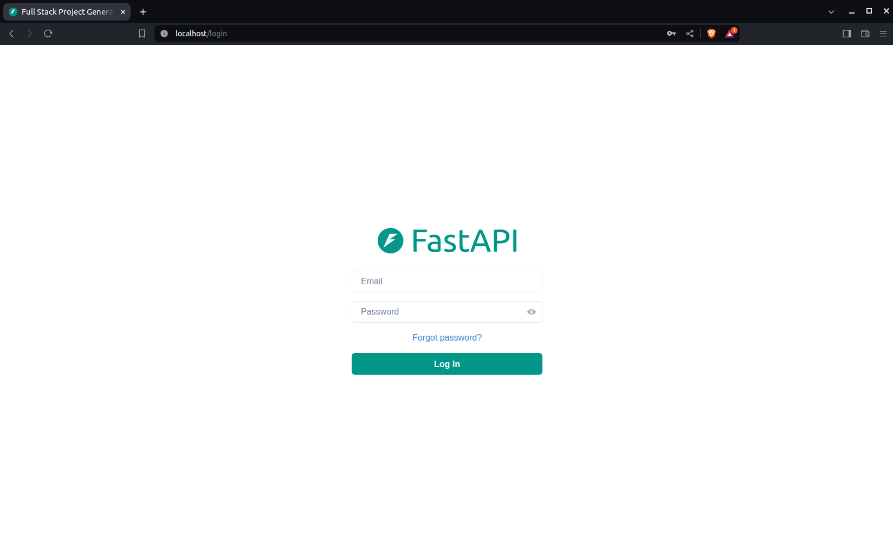
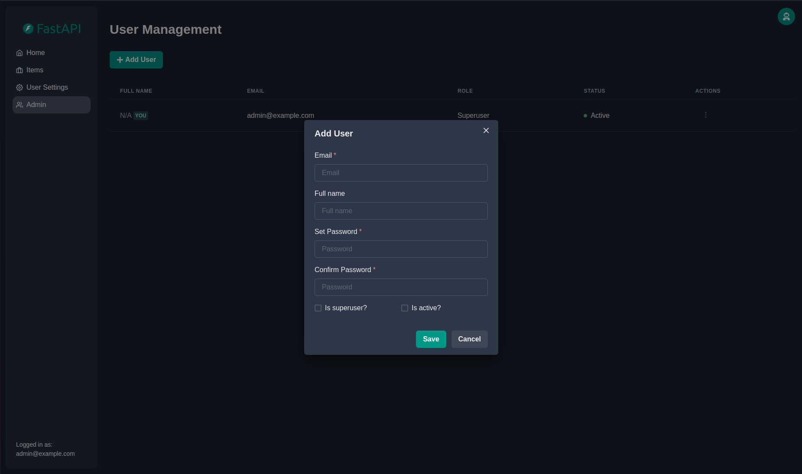

# Full Stack FastAPI Template

### Note: This project based on the project https://github.com/fastapi/full-stack-fastapi-template, but use **MySQL** instead PostgreSQL

## Development
### 1. Start infra
- In `backend` folder, run command
```bash
    make start-infra
```
### 2. Start Backend
- In `backend` folder, setup `.venv` using `uv`
- run alembic for creating migration file by using command
```bash
    make migration-generate initialize_models
```
- Apply the migration and seed for initial user
```bash
  make migrate-up && make db-seed
```

- Start fastapi application
```bash
    fastapi dev app/main.py
```

### 3. Start Frontend
- In `frontend` folder, install dependencies
```bash
    npm install
```
- Run frontend app
```bash
    npm run dev
```

## Technology Stack and Features

- ⚡ [**FastAPI**](https://fastapi.tiangolo.com) for the Python backend API.
    - 🧰 [SQLModel](https://sqlmodel.tiangolo.com) for the Python SQL database interactions (ORM).
    - 🔍 [Pydantic](https://docs.pydantic.dev), used by FastAPI, for the data validation and settings management.
    - 💾 [MySQL](https://www.mysql.com/) as the SQL database.
- 🚀 [React](https://react.dev) for the frontend.
    - 💃 Using TypeScript, hooks, Vite, and other parts of a modern frontend stack.
    - 🎨 [Chakra UI](https://chakra-ui.com) for the frontend components.
    - 🤖 An automatically generated frontend client.
    - 🧪 [Playwright](https://playwright.dev) for End-to-End testing.
    - 🦇 Dark mode support.
- 🐋 [Docker Compose](https://www.docker.com) for development and production.
- 🔒 Secure password hashing by default.
- 🔑 JWT (JSON Web Token) authentication.
- 📫 Email based password recovery.
- ✅ Tests with [Pytest](https://pytest.org).
- 📞 [Traefik](https://traefik.io) as a reverse proxy / load balancer.
- 🚢 Deployment instructions using Docker Compose, including how to set up a frontend Traefik proxy to handle automatic HTTPS certificates.
- 🏭 CI (continuous integration) and CD (continuous deployment) based on GitHub Actions.

### Dashboard Login

[](https://github.com/fastapi/full-stack-fastapi-template)

### Dashboard - Admin

[](https://github.com/fastapi/full-stack-fastapi-template)

### Dashboard - Create User

[](https://github.com/fastapi/full-stack-fastapi-template)

### Dashboard - Items

[](https://github.com/fastapi/full-stack-fastapi-template)

### Dashboard - User Settings

[](https://github.com/fastapi/full-stack-fastapi-template)

### Dashboard - Dark Mode

[](https://github.com/fastapi/full-stack-fastapi-template)

### Interactive API Documentation

[](https://github.com/fastapi/full-stack-fastapi-template)

## License

The Full Stack FastAPI Template is licensed under the terms of the MIT license.
